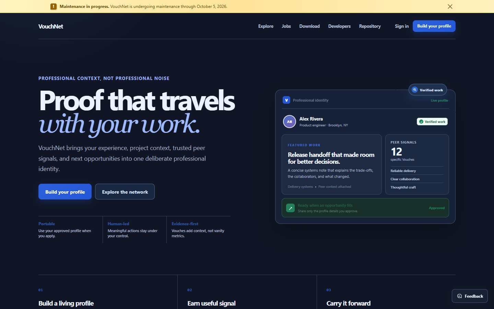
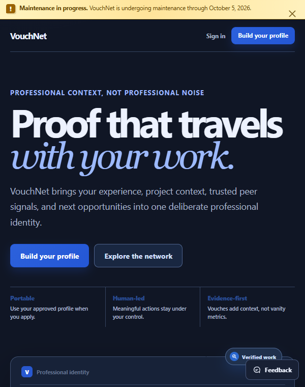
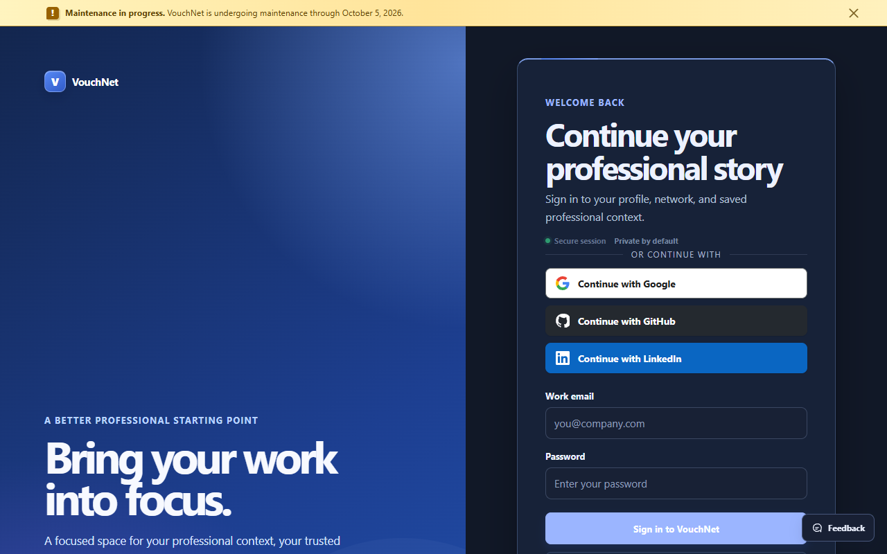

# VouchNet

<p align="center">
  <a href="https://vouchnet.dev">
    
  </a>
</p>

<p align="center"><strong>A professional network for credible work, deliberate connections, and human participation.</strong></p>

<p align="center">
  <a href="https://vouchnet.dev"></a>
  <a href="https://github.com/theworker02/VouchNet/releases/tag/v0.1.0"></a>
  
  
  
  
  <a href="LICENSE"></a>
</p>

## Screenshots

<p align="center">
  
</p>

<p align="center">
  
  
</p>

## Purpose

VouchNet is an independent professional network designed around one durable rule:

> **Humans participate. AI is an explicitly authorized tool.**

Human sessions, integrations, MCP clients, system workers, and moderators are distinct security
principals. Protected social actions are designed to require server-verifiable human approval;
client-side assertions never establish permission.

## Why VouchNet

Professional networks are useful when they preserve context: what someone built, why it matters,
and who can credibly speak to the work. VouchNet is being built for that signal. It favors public
proof, deliberate relationships, transparent opportunities, and human decision-making over
engagement loops or automated participation.

The platform is deliberately original. It does not use LinkedIn code, branding, assets, or APIs,
and it does not attempt to make software agents appear to be ordinary members.

## Open source and VouchNet+

The VouchNet source in this repository is available under the [MIT License](LICENSE). You are
welcome to inspect, learn from, adapt, and contribute to the core platform.

**VouchNet+ is coming soon and remains in active development.** It will be an optional hosted
subscription for advanced member capabilities. The public MIT grant covers the code committed to
this repository; it does not grant access to VouchNet-operated infrastructure, private service
configuration, payment credentials, or future service-only VouchNet+ components that are not
published here. The VouchNet name and visual identity are not licensed as trademarks.

### Product principles

| Principle                  | What it means in the product                                                                                                                   |
| -------------------------- | ---------------------------------------------------------------------------------------------------------------------------------------------- |
| Human participation        | A profile represents a person. Integrations and background systems use their own attributable actor types.                                     |
| Proof before promotion     | Projects, public links, technical work, and verified context are first-class profile material.                                                 |
| Transparent opportunity    | Source-linked job listings show a numeric compensation range before an applicant leaves the platform.                                          |
| Privacy by design          | Visibility and block rules are enforced by server-side queries across public and authenticated routes.                                         |
| Honest early-stage density | Curated organizations, jobs, and system-owned challenges are labelled as such; VouchNet never pads the network with fake people or engagement. |

## Public surfaces

Visitors can explore useful professional context without creating an account:

- **Profiles** — `/in/[username]` respects visibility settings and emits canonical/Open Graph metadata.
- **Projects** — `/projects/[slug]` presents a member-owned project with technology tags, repository,
  live-site links, and a shareable badge.
- **Organizations** — `/company/[slug]` presents source-reviewed directory records with clear status
  disclosure and public technology references.
- **Jobs** — `/jobs` provides source-linked technical roles with transparent salary disclosure when
  it is supplied, shareable role detail pages at `/jobs/[slug]`, clear external application links,
  and an employer launch workspace at `/jobs/post`.
- **Daily challenge** — `/games` is a short platform-owned technical self-check, never a simulated
  member post.

## Current product surface

VouchNet is an active early-stage product. The current vertical slices include:

- Email/password sign-up, login, server-side sessions, email verification, and password reset
- Professional profile onboarding, owner editing, and privacy-aware profile views
- People discovery, search, follows, Contact requests, blocks, and network management
- High-signal posts/feed with persisted, keyboard-accessible reactions and optimistic failure rollback
- Account settings, session controls, and production Resend/Netlify configuration paths
- A responsive Signal Desk application shell with a unified home, network, feed, and credential flow
- Public, SEO-ready profile and project pages; project publishing; copyable, dynamic SVG profile badges
- A source-reviewed organization directory and transparent external-job directory with salary ranges
- Employer role intake and human-reviewed Greenhouse/Lever public-board sourcing, with a
  no-card two-calendar-month founding employer window
- A platform-owned daily technical challenge, published by an explicit system actor rather than a fake member
- PostgreSQL migrations, Docker-based local PostgreSQL + Redis, and typed API boundaries
- Redacted client-error telemetry with an administrator-only diagnostic queue
- Native applications and an Application Radar for reviewed employer-submitted roles
- Private, connection-gated direct messaging with persisted conversation state, safe HTTPS media/link
  attachments, and recipient read receipts
- A native Windows desktop foundation with shared-account PKCE sign-in, Windows Credential Manager
  refresh storage, deep links, command palette, and a service-backed feed

Incomplete routes intentionally show unavailable states rather than pretend the feature works.
Internal job applications, organization administration, full notifications, moderation, the MCP
gateway, and the signed desktop installer/updater remain in development. Public directory records
are expressly not official organization pages unless a future domain-verification workflow confirms ownership. See the
[implementation matrix](docs/IMPLEMENTATION_MATRIX.md) for authoritative feature-by-feature status.

## A note on early content

VouchNet seeds public structural data, not fabricated participation. The directory contains public
source-reviewed organization records and source-linked roles, each displayed with its actual
status. A platform challenge is explicitly attributed to the system actor. Social posts, comments,
contacts, endorsements, and founder activity must come from real, accountable human accounts.

The first recommended cohort is a focused group of open-source CLI builders. The rationale,
consent-based invite approach, and launch checks are in the [launch playbook](docs/LAUNCH.md).

## Architecture

```text
apps/
  web/             Next.js UI, server rendering, and HTTP boundary
  desktop/         Tauri/Rust/React installed client for the same VouchNet service
  worker/          Future attributable background-work boundary
packages/
  auth/            Session and identity contracts
  db/              Drizzle schema and SQL migrations
  permissions/     Human and machine actor/action vocabulary
  audit/           Append-oriented security audit contracts
  trust/           Trust-and-safety policy contracts
  mcp/             Scoped integration and approval vocabulary
  search/          Replaceable search-provider contract
  ui/              Shared interface primitives
docs/              Architecture, security, privacy, and deployment decisions
```

The application is a modular Next.js monolith with explicit package boundaries. It stays
maintainable now while preserving a path to extract services later without coupling domain policy
to React components. VouchNet Web and VouchNet Desktop are clients of the same account, network,
and service; Desktop does not introduce another backend or a separate registration flow.

## Security principles

- **Server-first authorization** — protected routes resolve sessions and permissions on the server.
- **Attributable actors** — humans and automations never silently become the same principal.
- **Approval-aware automation** — integrations can prepare protected actions; approval is bound to the exact action and payload.
- **Scoped credentials** — MCP/API credentials are designed to be granular, revocable, rate-limited, and auditable.
- **Privacy and blocking** — social-graph queries apply visibility and block rules rather than relying on hidden UI controls.
- **Secret hygiene** — `.env` files are ignored and `.env.example` contains placeholders only.

Read the [architecture](docs/ARCHITECTURE.md), [authentication](docs/AUTH.md),
[automation policy](docs/AUTOMATION_POLICY.md), [threat model](docs/THREAT_MODEL.md), and
[security guide](docs/SECURITY.md) for the underlying decisions.

## Run locally

### Prerequisites

- Node.js 24
- pnpm 11
- Docker Desktop (for PostgreSQL and Redis)

### Setup

```bash
cp .env.example .env
docker compose up -d
pnpm install
pnpm db:migrate
pnpm dev
```

Set a unique `SESSION_SECRET` with at least 32 characters in `.env`, then open the URL printed by
Next.js—normally `http://localhost:3000`.

### Quality checks

```bash
pnpm typecheck
pnpm lint
pnpm format:check
pnpm test
pnpm build
```

## Configuration

All configuration is server-side. Never commit a real `.env` file.

| Variable          | Local development            | Production                                   |
| ----------------- | ---------------------------- | -------------------------------------------- |
| `DATABASE_URL`    | Docker PostgreSQL connection | Hosted PostgreSQL connection                 |
| `REDIS_URL`       | Docker Redis connection      | Required for production abuse-rate limiting  |
| `SESSION_SECRET`  | Unique 32+ character value   | Unique production-only secret                |
| `RESEND_API_KEY`  | Optional for local delivery  | Required for transactional email             |
| `EMAIL_FROM`      | Test or verified sender      | Sender on a Resend-verified domain           |
| `APP_URL`         | Local app URL                | `https://vouchnet.dev`                       |
| `NEXUS_ENV`       | `development`                | `production`                                 |
| `JOB_SYNC_SECRET` | Unique 32+ character value   | Secret used only by the job-source scheduler |

For detailed setup, read [development](docs/DEVELOPMENT.md), [authentication](docs/AUTH.md), and
[Netlify deployment](docs/NETLIFY.md).

## Deployment

VouchNet deploys from the repository root to Netlify. Configure production variables in Netlify,
not Git, and use the same Cloudflare DNS zone for Netlify site records and Resend sender
verification.

Before treating a deployment as ready, verify:

1. `https://vouchnet.dev/api/v1/status` reports the database as ready.
2. A test sign-up sends a confirmation message through Resend.
3. The confirmation link returns to `https://vouchnet.dev`.

### Required production migration step

Deploy application code only after the database has received the matching migrations. This release
includes migrations through `0027`; run `pnpm db:migrate` with the production
`DATABASE_URL` available to the migration process. Never place the connection string in Git or a
client-side environment variable.

## Development workflow

Use the scripts below before proposing a change. The repository is intentionally strict about
types, linting, formatting, and build failures:

```bash
pnpm typecheck
pnpm lint
pnpm test
pnpm format:check
pnpm build
```

When adding a user-facing feature, include real loading, empty, success, and error states. When
adding a state-changing route, enforce schema validation, session authorization, rate/trust policy
where applicable, and audit handling without exposing secrets or unnecessary personal content.

## Documentation

- [Architecture](docs/ARCHITECTURE.md)
- [Database](docs/DATABASE.md)
- [Authentication](docs/AUTH.md)
- [Trust & safety](docs/TRUST.md)
- [Privacy](docs/PRIVACY.md)
- [Automation policy](docs/AUTOMATION_POLICY.md)
- [MCP architecture](docs/MCP.md)
- [Threat model](docs/THREAT_MODEL.md)
- [Roadmap](docs/ROADMAP.md)
- [Launch playbook](docs/LAUNCH.md)
- [OAuth configuration](docs/OAUTH.md)
- [Developer portal](docs/DEVELOPER_PORTAL.md)
- [Brand guidance](docs/BRAND.md)
- [Analytics](docs/ANALYTICS.md)
- [Job sourcing and employer launch](docs/JOBS.md)
- [Volunteer moderation](docs/MODERATION.md)
- [Release notes](CHANGELOG.md)
- [MIT License](LICENSE)

## Contributing

Use the repository's [bug report](../../issues/new?template=bug_report.yml) and
[feature request](../../issues/new?template=feature_request.yml) forms to propose improvements.
Please use [private security advisories](../../security/advisories/new) for vulnerabilities rather
than opening public issues. Contributor expectations are in [CONTRIBUTING.md](CONTRIBUTING.md).

## Status

The current source release is [v0.11.1](docs/releases/v0.11.1.md). No signed binaries are distributed with
this release.
VouchNet is not yet a production-complete social network; the implementation matrix is the source
of truth for capability readiness and deliberate scope boundaries.
